= Open GL

This notes follows the learnings from http://www.opengl-tutorial.org/

Go to git: https://gricad-gitlab.univ-grenoble-alpes.fr/chakkak/ogl_tut.git for code.
All changes are done only in  *playground* folder. Each tutorial has an associated tag with it.

== Code Sequence
=== Skeleton
* Initialize the widow manager software: *glfwInit*
* Set the properties: *glfwWindowHint*
* Setup window:
** Create window: *glfwCreateWindow*
** Make it current one: *glfwMakeContextCurrent*
** Setup input mode of GLFW: *glfwSetInputMode*
* Setup OpenGL: *glewInit*
+
[WARNING]
====
If you call any opengl apis before this, program will crash
====
* Load shader programs(if you have one): *LoadShaders*(defined in common/shader.cpp)
+
[WARNING]
====
Be sure to give proper paths for your shader programs
====
* __Do your thing__
* While window is open or esc key not pressed
** clear the screen: *glClear*
** run shader programs(if you have one): *glUseProgram*
** __Do your thing__
** swap buffers: *glfwSwapBuffers*
** poll event: *glfwPollEvents*
* Cleanup
** Delete any buffers created: *glDeleteBuffers*
** Delete any vertex arrays created: *glDeleteVertexArrays*
** Delete shader programs: *glDeleteProgram*
* Close window and terminate GLFW: *glfwTerminate*

=== Do your thing
* Before while
** define your object, and it's attributes
+
[IMPORTANT]
====
OpenGL only knows triangles. So every object that you want to model should be represented as composite of triangles.
Ex: A cube can't be represented as 6 faces but rather as 12 triangles(2 triangles/face).
====
** Do MVP calculations
** move the data to be applied to GPU
* while

== Shaders
2 shaders required

* usage
** 2 shader programs in separate files
** Programmed in GLSL(GL Shader Language)
** Compiled at run-time during every execution of application
** Shaders are not directly accessible, only an ID is return when they are created

=== Vertex shader
Executed for each vertex. Each vertex can have numerous attributes : A position, one or several colours,
one or several texture coordinates, lots of other things.
[NOTE]
====
Max number of attributes is defined by GL_MAX_VERTEX_ATTRIBS value
====
* Steps
** Create buffer and pass data to it
*** buffer for vertices position created: *glGenBuffers*
*** describe above buffer as array buffer: *glBindBuffer*
*** co-ord positions data passed to buffer: *glBufferData*
** In while(1)
*** Link buffer to an attribute of vertex for use by shader
**** Attribute __n__ of vertices is enabled: *glEnableVertexAttribArray*
**** buffer created above linked to Attribute 0: *glBindBuffer*
**** *glVertexAttribPointer* is used to describe the data in buffer
**** in vert shader the Attribute __n__ containing co-ord positions is received as input: *in* as variable of
the data type appropriate to the one that fits the description in *glVertexAttribPointer*(in this case *vec3*) with the
attribute position: *layout(location=__n__)* for nth attribute
*** Using the value received in shader
**** normally value received is manipulate or with built-in variables. Ex: *gl_Position* in this case.
*** Draw the triangles(in cpp code): *glDrawArrays*
*** Delink buffer to an attribute of vertex
**** Disable Attribute __n__ of vertices: *glDisableVertexAttribArray*

=== Fragment shader
Executed for each sample.
[NOTE]
====
Since we are using 4x anti-aliasing, we have 4 sample/pixel
====
Colour is assigned using this shader.

* Steps
** nothing much as of now

== Co-ordinate Geo
Interpreting the axis:

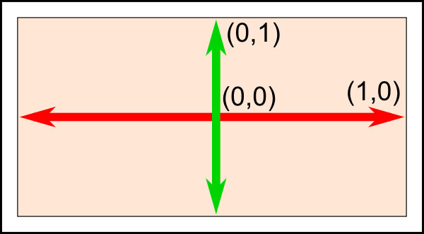
Right hand rule

* x: thumb to right
* y: index finger to sky
* z: middle finger to yourself

=== Homogeneous co-ordinates

Normally we represent each vertex via 3 dimension(x, y, z), now we introduce 4th dimension w. This allows us to use a
single math formula to deal with both rotation and translation.
From now on:

* If w == 1, then the vector (x,y,z,1) is a position in space.
* If w == 0, then the vector (x,y,z,0) is a direction.

==== Transformation matrices

It's 4x4 matrix when multiple with our vertex vector(4x1) we get another vector(4x1).

* Translation matrix
+
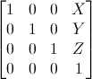
** To move a vertex at (10, 10, 10) by 10 units in x direction:
+
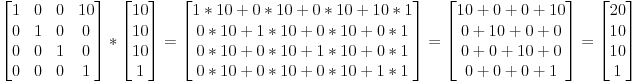
+
In output (20, 10, 10, 1), as mentioned previously 1 indicates position, therefore we get (20, 10, 10) as new position

** To represent towards -Z axis direction:
+
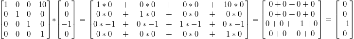
+
The answer is (0,0,-1) representing -z direction and the 4th dimension is 0. The answer is correct even though
we tried to multiply it with X=10 in translation matrix. Moving a direction doesn't make sense.
That's why the result makes sense and math holds up!

* Scaling matrix
+
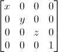
** To scale a vector in all x, y and z
+
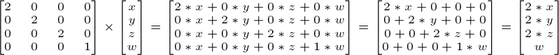
+
w didnt change

* Rotation matrix
+
For now nothing

Combining all together:
----
Transformation Matrix = Translation Matrix * Rotation Matrix * Scaling Matrix
Transformed vector = Transformation Matrix * Original vector
----
[IMPORTANT]
====
The order of the products mentioned above should not be changed.
====
The execution order:

* scale
* rotate
* translate

==== Model, View & Projection matrices
Convenient way to separate transformations clearly.

* Model matrix
+
Defined by set of vertices. If object's center is origin(like triangle in tutorial 2) it's called Model view.
+
Now if we move the model in any direction using Transformation matrix, the (real) origin is no longer at the
center of the object. This is called world view.
+
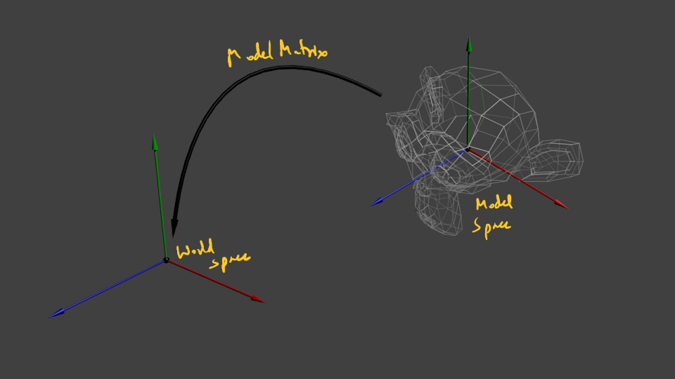

* View matrix
+
From perspective of camera. Initially camera's center is at the world view's origin.
To move camera __x__ units on right, you can move the whole world __x__ units to the left.
+
[NOTE]
====
What is camera? It's actually a frame which stores all the part of the world that's currently within its bounds.
Maybe this frame is more of a part of hardware buffer or something.
Hence, to move the camera, you need to move the world in the hardware buffer and
get the new view from the frame part of buffer.
====
+
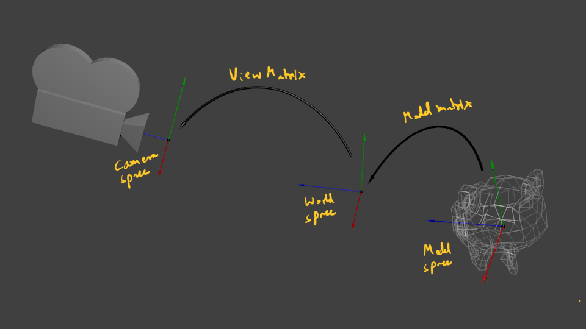

* Projection matrix
+
Initially, whatever seen by the camera is orthogonal projection. But, in reality things near to camera(bigger z) appear
more near to center and vice-versa i,e, perspective projection. Projection matrix will provide this.
+
[NOTE]
====
After being multiplied by the Projection matrix(???), homogeneous coordinates are divided by their own w component.
This w = -z. This way, points that are far away from the origin are divided by a big z;
their x and y coordinates become smaller; points become more close to each other, objects seem smaller; and
this is what gives the perspective. This transformation is done in hardware, and is not visible in the shader.
====
+
[WARNING]
====
I dont think I understand what exactly does Projection matrix do if hardware is dividing all co-ordinates by -z.
====
+
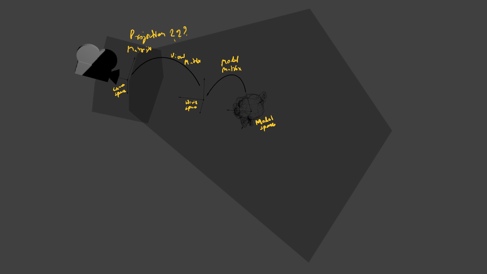

Putting together Model, View and Projection transforms:
----
MVP Matrix = Projection Matrix * View Matrix * Model Matrix
Transformed vertex = MVP Matrix * Original vertex
----

[NOTE]
====
The MVP calculation is done on CPU but applying MVP to each and very vertex is done in GPU.
====

== VAO
* Vertex Array Object

== Z-Buffer
When you draw a “far” triangle and a “near” triangle, if far gets drawn first and then near:

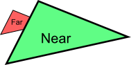

What if near gets drawn first and then far:

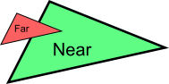

The solution is to store the depth(z) component of each fragment in a buffer, and each and every time you want to
write a fragment, you 1st check if you should (i.e the new fragment is closer than the previous one).

This is done in hardware by z-buffer.

== Texture
To texture(superimpose an image on the surface) a mesh(set of points that make up an object) you need to provide
special set of co-ordinates call UV co-ordinates to say which part of the image that is being laid upon the triangle.

image::UV_ex.png[UV co-ordinates]

Observe the red lines that indicate the how the part of the image is being superimposed on the triangle using
UV co-ordinates. Also you can see that the image is distorted to make sure that edges of image fit exactly at the
points defined by UV co-ordinates on the points of the triangle.

